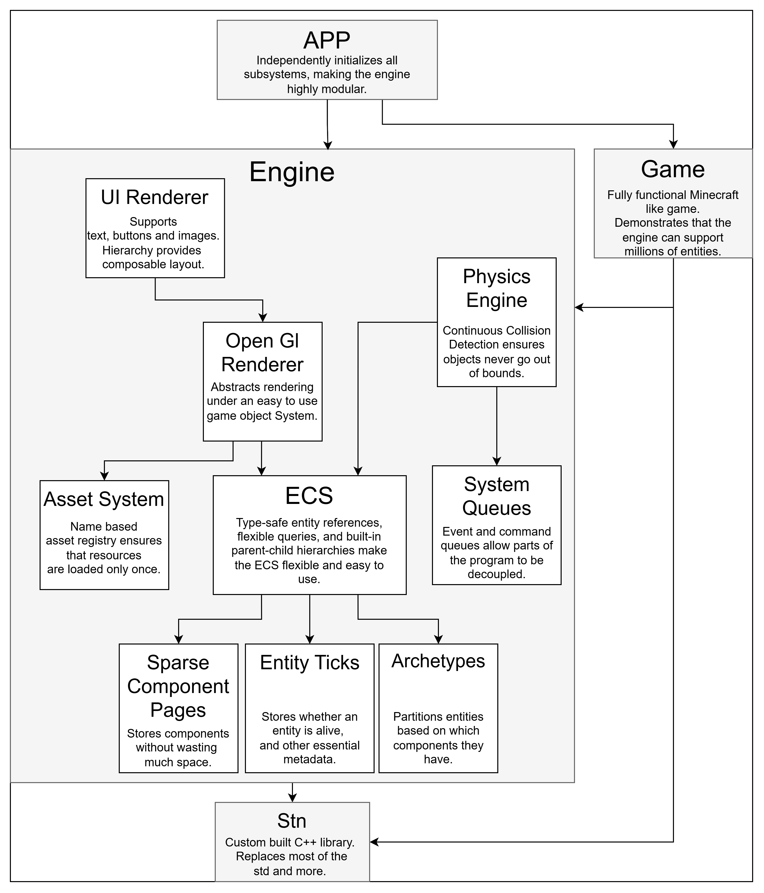

## STN Game Engine

A **C++ game engine**, based on a small ECS core, built from scratch.

## Design goals
  modular: parts of the engine generally don't rely on each other, besides the Ecs, allowing for quick changes to be made. 
  
  memory efficient: generally optimize more for memory usage than performance.

## Features

## Gameplay video

https://github.com/user-attachments/assets/1ad13605-a927-4ca8-91e9-dda546150a81

